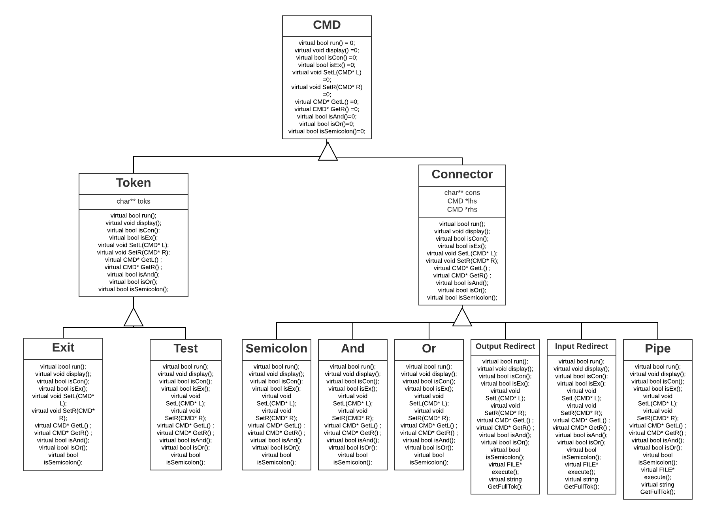

# CS 100 Programming Project

*WINTER 2020*
*Hamza Syed 862097875*
*Smit Patel 862076143*

## INTRODUCTION
  Our assignment will be able to accomplish reading the command line and executing the appropriate commands. It will be able
  to differentiate between OR, AND, and a semicolon until an exit command is reached. Our design pattern illustrates the use
  of composite classes referenced from parent classes. The design contains classes for the command tokens, as well as classes
  for the connectors. The connector class has subclasses for each connector (AND, OR, and SEMICOLON), and there is one 
  subclass for the tokens class as well. All subclasses have a run function designed to run the command prompt in sync with 
  the connectors next to the command token.
  
  
  ## OMT DIAGRAM
  
  
  
  
  ## CLASSES
    
    Our base class is the CMD class. This class stores the input from the command line and distribute it to the Token and Connector
    classes. The Connector class keeps track of the left hand side of the connectors and right hand side of the connectors and assigns
    them to the subclass of Semicolon, AND, OR. The Tokens class runs the commands as needed and checks if they properly executed. The
    Token class has a subclass called Exit that performs all the commands inorder and in accordance to the connectors. 
